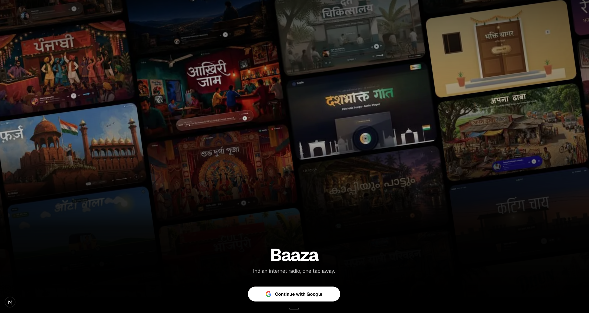
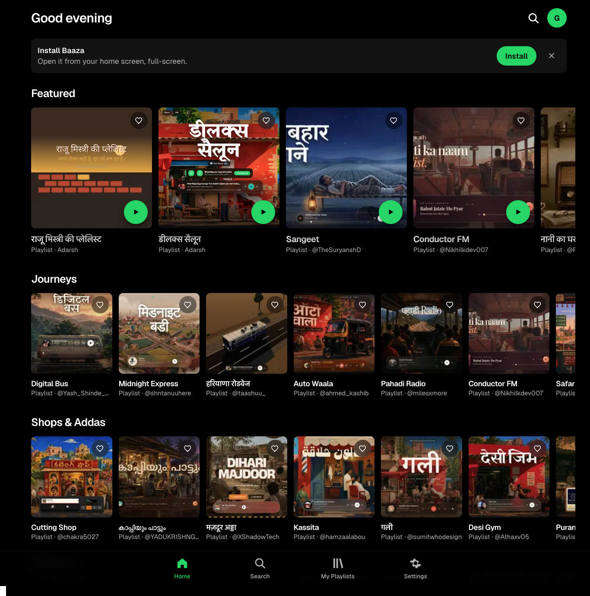

<div align="center">

# Baaza

**Indian internet radio, one tap away.**

A Spotify-style, installable web app that brings 100+ community-made Indian playlist sites (chai-shop radios, bus-journey mixes, festival sets, regional stations) into one dark, app-like home.

[**Live demo → baaza.vercel.app**](https://baaza.vercel.app)


</div>

---

## Screenshots

<p align="center">
  
</p>

<p align="center">
  
</p>

## Why Baaza?

There are around a hundred small, lovingly made Indian playlist and internet-radio sites out there: a *Cutting Shop* for Telugu barbershop bangers, a *Digital Bus* for long highway rides, a *Nani ka Ghar* for summer-vacation nostalgia. Each one lives on its own domain and was shared once on X by its creator, then scattered.

Baaza collects them in one place, lets you browse them by mood or occasion, remember the ones you love, and listen without ever leaving the app.

## Features

### 🏠 Home feed
- Time-aware greeting ("Good morning / afternoon / evening")
- A **Featured** rail plus horizontal, snap-scrolling rails for 9 categories: *Journeys, Shops & Addas, Regional, Festivals, Everyday, Bhakti & Desh, Late Night, School Days, Weddings*, ordered by size
- Cards show cover art, title and `Playlist · @creator`; offline sites are dimmed with an "Offline" pill
- Generated gradient fallback for cards without cover art
- Server-rendered with minimal client JavaScript for a fast first paint

### 🔍 Search
- Full-screen overlay with instant, as-you-type results that also work **offline**
- Case-, whitespace- and diacritic-insensitive matching
- Searches original-script titles (Hindi, Malayalam, Tamil, …) **and** their English titles, plus category, creator handle and description, ranked in that order
- "Browse all" category chips and your last 8 searches

### 🎧 In-app browser
- Playlists open full-screen inside Baaza, with the cover art morphing into the player and a crossfade once the site loads
- One floating back button that fades when idle; Android back and iOS edge-swipe close the player and restore your scroll position
- Every playlist has its own shareable URL (`/play/[slug]`)
- Sandboxed frame: embedded sites can't request location, mic or camera
- **Background playback:** a near-silent looping track in the top frame keeps audio alive when the phone is locked or the tab is hidden
- **Smart fallback for sites that refuse framing:** a server route reads the site's `Content-Security-Policy: frame-ancestors` and `X-Frame-Options` headers and, if blocked, opens it in a new tab behind a short "Opening …" sheet. Sites that silently fail are detected and remembered per device.

### ❤️ My Playlists
- Favourite from the feed, search or the player
- Newest-first library, synced across open tabs in real time

### 📲 Installable PWA
- Add to Home Screen on Android/desktop Chrome (native prompt) and iOS (Share-sheet instructions)
- Full-bleed standalone display with a true-black theme
- Service worker caches the app shell and cover art, so the feed, search and artwork work offline. Third-party playlist sites are never intercepted.

### ⚙️ Settings
- Guest profile, install shortcut, clear favourites / recent searches, sign out, app version and creator credits

## Tech Stack

| Layer | Choice |
| --- | --- |
| Framework | [Next.js 16](https://nextjs.org) (App Router, Turbopack) |
| UI | React 19, TypeScript (strict) |
| Styling | Tailwind CSS v4 (tokens in `app/globals.css` via `@theme inline`) |
| State | `localStorage` + `useSyncExternalStore`, no external state library |
| Offline | Hand-written service worker (`public/sw.js`) + web manifest |
| Testing | Vitest |
| Hosting | Vercel |

## Project Structure

```
baaza/
├── app/
│   ├── (app)/              # Signed-in shell with bottom tab bar
│   │   ├── home/           # Home feed
│   │   ├── search/         # Search
│   │   ├── library/        # My Playlists
│   │   └── settings/       # Settings
│   ├── play/[slug]/        # In-app browser / player
│   ├── api/embed/[slug]/   # Server-side "can this site be framed?" check
│   ├── manifest.ts         # PWA manifest
│   └── page.tsx            # Sign-in gate
├── components/             # Cards, rails, tab bar, search overlay, in-app browser…
├── lib/
│   ├── playlists.ts        # Card types, validation, category grouping
│   ├── frame-policy.ts     # CSP / X-Frame-Options parser
│   ├── background-audio.ts # Keeps playback alive in the background
│   ├── use-favorites.ts    # Favourites hook
│   ├── use-session.ts      # Session (fake auth in v1)
│   └── storage.ts          # Typed, cross-tab localStorage store
├── data/
│   └── playlist_cards.json # The catalogue
├── public/
│   ├── images/             # Cover art, one per card
│   ├── collage.jpg         # Sign-in backdrop
│   └── sw.js               # Service worker
└── scripts/
    ├── probe-embeddable.mjs # Re-checks which sites allow framing
    └── build-collage.mjs    # Rebuilds the sign-in collage
```

## Getting Started

**Prerequisites:** Node.js 20+ and npm.

```bash
git clone https://github.com/Adarsh-kushwaha/baaza.git
cd baaza
npm install
npm run dev
```

Open [http://localhost:3000](http://localhost:3000).

### Scripts

| Command | What it does |
| --- | --- |
| `npm run dev` | Start the dev server |
| `npm run build` | Production build |
| `npm run start` | Serve the production build |
| `npm run lint` | Lint with ESLint |
| `npm run test` | Run tests with Vitest |
| `npm run collage` | Rebuild `public/collage.jpg` from all cover art (needs `sharp`: `npm i -D sharp`) |
| `node scripts/probe-embeddable.mjs` | Re-probe every live site and update `embeddable` in the catalogue |

### Environment variables

| Variable | Default | Purpose |
| --- | --- | --- |
| `NEXT_PUBLIC_AUTH_MODE` | `fake` | Auth mode. v1 only supports a local guest session. |
| `BAAZA_ORIGIN` | – | Used by `probe-embeddable.mjs` to count sites whose `frame-ancestors` allowlist includes Baaza |

## Adding a Playlist

1. Add the cover image to `public/images/`.
2. Add an entry to `data/playlist_cards.json`:

   ```json
   {
     "id": 104,
     "slug": "cutting-shop",
     "title": "Cutting Shop",
     "titleEn": null,
     "description": "Telugu cutting shop bangers",
     "url": "http://cuttingshop.lol",
     "domain": "cuttingshop.lol",
     "category": "Shops & Addas",
     "creator": "@chakra5027",
     "creatorUrl": "https://x.com/chakra5027",
     "status": "live",
     "image": "cutting-shop.jpg"
   }
   ```

   `category` must be one of the nine categories, `status` is `live` or `offline`, and `titleEn` should be set for non-English titles so they're searchable in English.
3. Run `node scripts/probe-embeddable.mjs` to stamp the `embeddable` flag.
4. Optionally run `npm run collage` to refresh the sign-in backdrop.

## Roadmap

- [ ] Real Google sign-in (the fake session is already isolated behind `use-session.ts` and `NEXT_PUBLIC_AUTH_MODE`)
- [ ] Sync favourites across devices
- [ ] Creator-submitted playlists

## Credits

Every playlist in Baaza was built by an independent creator, and each card links back to its creator's profile. Baaza is only a directory: all music and sites belong to their respective creators. The initial catalogue was compiled with the help of [goonj.wtf](https://goonj.wtf).

If you made one of these sites and want it updated or removed, please [open an issue](https://github.com/Adarsh-kushwaha/baaza/issues).

## Author

Built by **Adarsh Kushwaha**: [GitHub](https://github.com/Adarsh-kushwaha)

---

<div align="center">If Baaza brought back a memory, drop a ⭐</div>
